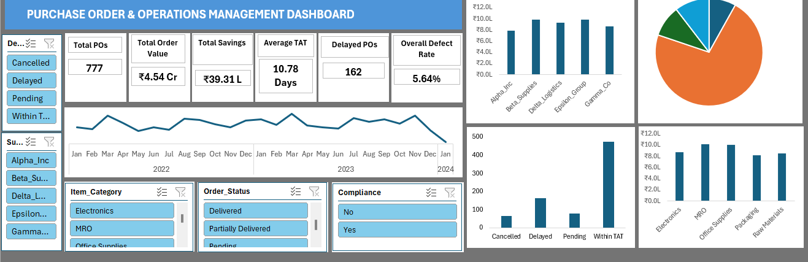

# Procurement-KPI-Analysis

Excel-based Procurement & Purchase Order Operations Analysis with an interactive dashboard for monitoring procurement spending, savings, supplier performance, delivery, quality, and compliance.

## 📊 Project Overview

This project analyzes purchase order data to understand procurement performance and identify operational improvement areas.

The analysis covers:

- Purchase order volume and status
- Procurement spending
- Negotiated price savings
- Supplier performance
- Delivery performance
- Product category performance
- Defect and quality analysis
- Supplier compliance

## 🎯 Business Objective

To transform raw purchase order data into actionable insights that can help procurement teams monitor operational performance, identify problem areas, and make better supplier and purchasing decisions.

## 🛠️ Tools & Technologies

- Microsoft Excel
- Power Query
- Pivot Tables
- Pivot Charts
- Excel Slicers
- Excel Formulas
- Data Cleaning & Analysis

## 📈 Key KPIs

| KPI | Value |
|---|---:|
| Total Purchase Orders | 777 |
| Total Procurement Value | ₹4.54 Cr |
| Total Savings | ₹39.31 L |
| Average TAT | 10.78 Days |
| Delayed POs | 162 |
| Overall Defect Rate | 5.64% |

## 🔍 Key Business Insights

- Total procurement value analyzed is approximately **₹4.54 Cr across 777 purchase orders**.
- Negotiated supplier prices resulted in approximately **₹39.31 Lakh in identified savings**.
- **162 purchase orders were delayed**, requiring operational follow-up.
- **154 POs were pending or partially delivered**, highlighting incomplete order fulfillment.
- **Delta_Logistics** requires attention due to its **11% defect rate** and **61% compliance rate**.
- Overall procurement defect rate is **5.64%**.
- Supplier performance was evaluated using cost, delivery, quality, and compliance indicators.

## 📊 Interactive Dashboard

The Excel dashboard provides a consolidated view of:

- Procurement KPIs
- Monthly order value trend
- PO status distribution
- Supplier performance
- Delivery performance
- Category performance
- Supplier, category, order status, compliance, and delivery status filters

### Dashboard Preview

## 📁 Project Files

- `Procurement KPI Analysis Dataset.xlsx` — Complete Excel analysis workbook
- `dashboard.png` — Dashboard preview
- `README.md` — Project documentation

## 💡 Business Recommendations

1. Prioritize delayed and incomplete purchase orders for follow-up.
2. Review suppliers with high defect rates and low compliance.
3. Strengthen supplier compliance monitoring.
4. Evaluate suppliers using multiple performance indicators instead of cost alone.
5. Continue monitoring negotiated-price savings to improve procurement efficiency.

## 📌 Conclusion

This project demonstrates how raw purchase order data can be transformed into meaningful business insights using Excel. The interactive dashboard provides management with a consolidated view of procurement spending, savings, supplier performance, delivery, quality, and compliance to support data-driven procurement decisions.

## 👩‍💻 Author

**Shweta Kumari**

BE Computer Science & Engineering
